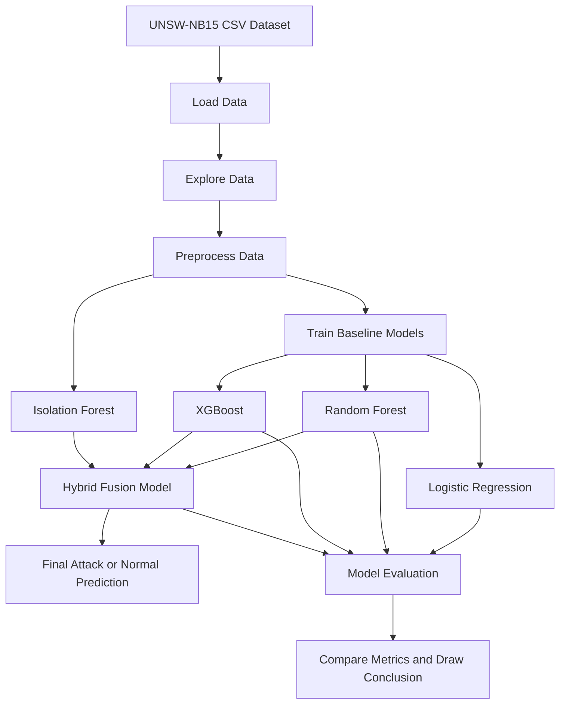

# Detailed Research Explanation

## 1. Research Title

Hybrid Intrusion Detection System using Machine Learning on the UNSW-NB15 Dataset

## 2. What This Research Is About

This research is about detecting cyber attacks in network traffic.

Network traffic means the data packets that move between computers, servers, and the internet. Some traffic is normal, such as opening a website or sending a file. Some traffic is harmful, such as scanning a system, trying to break into a server, or sending attack packets.

The main goal of this research is to build an Intrusion Detection System, also called IDS. An IDS is a system that watches network activity and tries to decide whether the activity is normal or an attack.

In this project, we use machine learning models to learn patterns from old network traffic data. After learning these patterns, the models try to predict whether new traffic is normal or malicious.

## 3. Main Aim of the Research

The aim of this research is to compare different machine learning models for intrusion detection and then build a hybrid model that combines the strengths of more than one model.

The research does the following:

1. Loads the UNSW-NB15 network security dataset.
2. Studies the dataset to understand normal traffic and attack traffic.
3. Cleans and prepares the data for machine learning.
4. Trains different models such as Logistic Regression, Random Forest, and XGBoost.
5. Builds a hybrid model using Random Forest, XGBoost, and Isolation Forest.
6. Compares the models using accuracy, precision, recall, F1-score, ROC AUC, and PR AUC.
7. Explains which model performed better and why.

## 4. Why Intrusion Detection Is Important

Cyber attacks can damage systems, steal information, or stop services from working. Manual checking is not enough because networks produce a large amount of data every second.

Machine learning helps because it can learn patterns from many examples. It can notice unusual traffic faster than a human can manually check every packet.

An IDS can help organizations:

- Detect attacks early.
- Reduce damage from cyber threats.
- Protect private data.
- Improve network security.
- Support security teams with automatic alerts.

## 5. Important Terms in Simple English

### Intrusion Detection System

An Intrusion Detection System is a security system that checks network activity and tries to find attacks.

### Network Traffic

Network traffic is the movement of data between devices on a network.

### Packet

A packet is a small part of data sent over a network.

### Feature

A feature is one column in the dataset. It gives information about the network connection, such as duration, number of packets, number of bytes, or protocol type.

### Label

A label tells the correct answer for each row. In this dataset, label `0` means normal traffic and label `1` means attack traffic.

### Attack Category

Attack category tells the type of attack, such as DoS, Exploits, Fuzzers, Generic, or Reconnaissance.

### Machine Learning

Machine learning is a method where a computer learns from data instead of being directly programmed with every rule.

### Training Data

Training data is the data used to teach the model.

### Testing Data

Testing data is the data used to check how well the model works on new examples.

### Preprocessing

Preprocessing means cleaning and preparing the data before giving it to the machine learning model.

### Numerical Column

A numerical column contains numbers, such as packet count or byte count.

### Categorical Column

A categorical column contains names or groups, such as protocol type or service name.

### One-Hot Encoding

One-hot encoding changes text categories into numbers so machine learning models can use them.

### Standard Scaling

Standard scaling changes number columns into a similar scale. This helps some models learn better.

### Missing Value

A missing value means a value is empty or not available in the dataset.

### Logistic Regression

Logistic Regression is a simple machine learning model used for classification. It predicts whether something belongs to one class or another.

### Random Forest

Random Forest is a model made from many decision trees. It gives a prediction by combining the results of many trees.

### XGBoost

XGBoost is a powerful machine learning model that builds many small decision trees step by step and improves its mistakes.

### Isolation Forest

Isolation Forest is an anomaly detection model. It is useful for finding unusual data points that may be attacks.

### Hybrid Model

A hybrid model combines more than one model. In this project, the hybrid model combines Random Forest, XGBoost, and Isolation Forest.

### Fusion Model

A fusion model takes outputs from other models and combines them to make a final decision.

### Accuracy

Accuracy tells how many total predictions were correct.

### Precision

Precision tells how many predicted attacks were truly attacks.

### Recall

Recall tells how many real attacks the model successfully found.

### F1-Score

F1-score balances precision and recall. It is useful when both false alarms and missed attacks matter.

### ROC AUC

ROC AUC shows how well the model separates normal traffic from attack traffic across different thresholds.

### PR AUC

PR AUC shows how well the model performs when focusing on attack detection, especially when classes are not perfectly balanced.

### False Positive

A false positive means normal traffic was wrongly predicted as an attack.

### False Negative

A false negative means attack traffic was wrongly predicted as normal. In security, this is dangerous because an attack may be missed.

## 6. Dataset Used in This Research

This project uses the UNSW-NB15 dataset. This is a network intrusion detection dataset. It contains both normal network traffic and different types of attack traffic.

In this project, the data is stored in:

- `data/UNSW_NB15_training-set.csv`
- `data/UNSW_NB15_testing-set.csv`

The two files together contain about 257,673 rows and 45 columns.

The project has:

- 175,341 rows in the training CSV file.
- 82,332 rows in the testing CSV file.
- 257,673 total rows after combining both files.
- 93,000 normal traffic rows.
- 164,673 attack traffic rows.

## 7. Why We Use 60k+ Data Instead of Only 2k Data

We use a large dataset with 60k+ records, and in this project about 257k records, because cyber attacks have many different patterns. A small dataset with only 2k rows may miss rare attack types, may make the model memorize examples instead of learning real patterns, and may give weak results that are not convincing for a research guide or evaluator.

Using more data makes the research stronger because the model sees more examples of normal traffic and attack traffic. This helps the result look more realistic and reliable.

## 8. Dataset Column Explanation

Each row in the dataset represents one network flow or connection record. The columns describe what happened in that network flow.

| Column Name | Simple Explanation |
|---|---|
| `id` | A unique number used to identify each row. |
| `dur` | Duration of the network connection. It tells how long the connection lasted. |
| `proto` | Network protocol used, such as TCP, UDP, or another protocol. |
| `service` | The network service used, such as HTTP, FTP, DNS, or another service. |
| `state` | The connection state. It describes how the connection started, continued, or ended. |
| `spkts` | Number of packets sent from the source to the destination. |
| `dpkts` | Number of packets sent from the destination back to the source. |
| `sbytes` | Number of bytes sent from the source to the destination. |
| `dbytes` | Number of bytes sent from the destination back to the source. |
| `rate` | Packet rate. It shows how fast packets were sent during the connection. |
| `sttl` | Source time-to-live value. TTL helps show how far a packet can travel. |
| `dttl` | Destination time-to-live value. |
| `sload` | Source load. It shows the data load from source to destination. |
| `dload` | Destination load. It shows the data load from destination to source. |
| `sloss` | Number of source packets that were lost. |
| `dloss` | Number of destination packets that were lost. |
| `sinpkt` | Average time between packets from the source side. |
| `dinpkt` | Average time between packets from the destination side. |
| `sjit` | Source jitter. Jitter means variation in packet timing. |
| `djit` | Destination jitter. |
| `swin` | Source TCP window size. It is related to how much data can be sent before waiting. |
| `stcpb` | Source TCP base sequence number. It is used in TCP communication tracking. |
| `dtcpb` | Destination TCP base sequence number. |
| `dwin` | Destination TCP window size. |
| `tcprtt` | TCP round-trip time. It measures how long a TCP response takes. |
| `synack` | Time between SYN and SYN-ACK packets in TCP connection setup. |
| `ackdat` | Time between ACK and data packets. |
| `smean` | Average packet size from the source side. |
| `dmean` | Average packet size from the destination side. |
| `trans_depth` | Depth of HTTP transaction. It is useful for web traffic analysis. |
| `response_body_len` | Size of the HTTP response body. |
| `ct_srv_src` | Number of connections with the same service and source address. |
| `ct_state_ttl` | Number of connections with the same state and TTL value. |
| `ct_dst_ltm` | Number of connections to the same destination in a short time window. |
| `ct_src_dport_ltm` | Number of connections from the same source to the same destination port in a short time window. |
| `ct_dst_sport_ltm` | Number of connections to the same destination from the same source port in a short time window. |
| `ct_dst_src_ltm` | Number of connections between the same source and destination in a short time window. |
| `is_ftp_login` | Shows whether the connection includes an FTP login. |
| `ct_ftp_cmd` | Number of FTP commands used in the connection. |
| `ct_flw_http_mthd` | Number of HTTP methods used, such as GET or POST. |
| `ct_src_ltm` | Number of connections from the same source in a short time window. |
| `ct_srv_dst` | Number of connections with the same service and destination address. |
| `is_sm_ips_ports` | Shows whether source and destination IP addresses and ports are the same. |
| `attack_cat` | The attack type name. Normal traffic is marked as Normal. |
| `label` | Final class label. `0` means normal traffic and `1` means attack traffic. |

## 9. Attack Categories in the Dataset

The dataset contains normal traffic and different attack categories.

| Attack Category | Simple Meaning |
|---|---|
| Normal | Safe network traffic. |
| Generic | General attack traffic that follows common attack patterns. |
| Exploits | Attacks that try to use a weakness in software or a system. |
| Fuzzers | Attacks that send unusual or random input to find system weaknesses. |
| DoS | Denial of Service attacks that try to make a service unavailable. |
| Reconnaissance | Attacks that collect information about a system before a bigger attack. |
| Analysis | Attacks that study the system to find weak points. |
| Backdoor | Attacks that try to create a hidden way to enter the system later. |
| Shellcode | Code used by attackers to control or exploit a system. |
| Worms | Malware that can spread from one system to another. |

## 10. Research Architecture Diagram

## 11. Research Workflow in Simple Steps

### Step 1: Import Libraries

The notebook imports Python libraries used for data handling, graph drawing, machine learning, and model evaluation.

Important libraries used:

- `pandas` for reading and handling tables.
- `numpy` for numerical work.
- `matplotlib` and `seaborn` for charts.
- `scikit-learn` for machine learning models and evaluation.
- `xgboost` for the XGBoost model.

### Step 2: Load the Dataset

The notebook loads CSV files from the `data` folder. If CSV files are present, it combines them into one dataset.

In this project, it loads the UNSW-NB15 training and testing CSV files.

### Step 3: Explore the Dataset

The notebook checks:

- Number of rows and columns.
- Missing values.
- Count of normal and attack records.
- Count of each attack category.
- Basic statistics such as mean, minimum, maximum, and standard deviation.

This step helps us understand the data before building the model.

### Step 4: Draw Basic Charts

The notebook creates charts such as:

- Class distribution chart.
- Correlation heatmap.
- Feature distribution histograms.

These charts help us visually understand the dataset.

### Step 5: Separate Input and Output

The notebook separates the dataset into:

- `X`: input features used for prediction.
- `y`: target label, where `0` means normal and `1` means attack.

The `attack_cat` column is removed from model input because the binary prediction uses `label` as the final answer.

### Step 6: Preprocess the Data

The notebook prepares numerical and categorical columns separately.

For numerical columns:

- Missing values are filled using the median.
- Values are scaled using StandardScaler.

For categorical columns:

- Missing values are filled using the most common value.
- Text categories are converted into numbers using One-Hot Encoding.

### Step 7: Split the Data

The notebook splits the data into training and testing parts.

Training data is used to teach the model. Testing data is used to check the model.

The notebook uses stratified splitting, which keeps the normal and attack ratio similar in both training and testing data.

### Step 8: Train Baseline Models

The notebook trains three baseline models:

- Logistic Regression
- Random Forest
- XGBoost

These models predict the chance that a row is an attack.

### Step 9: Evaluate Baseline Models

The notebook calculates performance scores:

- Accuracy
- Precision
- Recall
- F1-score
- ROC AUC
- PR AUC

It also draws confusion matrix, ROC curve, and precision-recall curve.

### Step 10: Build the Hybrid Model

The hybrid model uses:

- Random Forest attack probability.
- XGBoost attack probability.
- Isolation Forest anomaly score.

These three outputs are combined into a small second-level model called a fusion model.

The fusion model learns how to combine these results and make the final prediction.

### Step 11: Compare All Models

The notebook compares Logistic Regression, Random Forest, XGBoost, and the hybrid model in one table.

This helps us see which model performs best.

### Step 12: Feature Importance

The notebook uses Random Forest feature importance to show which dataset columns helped most in making predictions.

This is useful because it explains which network features are important for attack detection.

### Step 13: Final Interpretation

The notebook prints the best model based on F1-score and gives a final research conclusion.

## 12. Jupyter Notebook Explanation

The notebook file is:

`notebooks/hybrid_ids_research_analysis.ipynb`

The notebook is divided into sections.

| Notebook Section | What It Does |
|---|---|
| Introduction | Explains that the project is about hybrid IDS research. |
| Dataset Loading | Loads CSV files from the data folder or creates a demo dataset if no CSV is found. |
| Exploratory Data Analysis | Checks shape, missing values, class count, attack categories, and statistics. |
| Data Preprocessing | Prepares the data by filling missing values, scaling numbers, and encoding text columns. |
| Baseline Models | Trains Logistic Regression, Random Forest, and XGBoost. |
| Model Diagnostics | Shows confusion matrix, ROC curve, and precision-recall curve for each model. |
| Hybrid Model | Combines Random Forest, XGBoost, and Isolation Forest using a fusion model. |
| Model Comparison | Compares models using important performance metrics. |
| Feature Importance | Shows which columns influenced the Random Forest model most. |
| Final Interpretation | Prints the best model and explains the final research result. |

## 13. Models Used in This Research

### Logistic Regression

This is the simplest model in the project. It gives a basic comparison point. If advanced models perform better than Logistic Regression, it shows that the advanced models are useful.

### Random Forest

Random Forest uses many decision trees. It is good at handling complex patterns and different types of features.

### XGBoost

XGBoost is usually strong for tabular datasets. It builds trees step by step and improves from previous mistakes.

### Isolation Forest

Isolation Forest is used to find unusual behavior. Since cyber attacks can look unusual compared to normal traffic, it is useful for intrusion detection.

### Hybrid Model

The hybrid model combines supervised learning and anomaly detection. Random Forest and XGBoost learn from labeled examples. Isolation Forest adds an anomaly score. The fusion model combines these signals to make the final prediction.

## 14. Model Results from This Project

The real UNSW-NB15 result file shows the following model performance:

| Model | Accuracy | Precision | Recall | F1-Score | ROC AUC |
|---|---:|---:|---:|---:|---:|
| XGBoost | 0.9123 | 0.8872 | 0.9632 | 0.9237 | 0.9854 |
| Random Forest | 0.8694 | 0.8148 | 0.9873 | 0.8928 | 0.9800 |
| Hybrid RF + XGBoost + Isolation Forest | 0.8680 | 0.8125 | 0.9883 | 0.8918 | 0.9787 |
| Logistic Regression | 0.8356 | 0.8023 | 0.9308 | 0.8618 | 0.9559 |

In these results, XGBoost has the best F1-score and accuracy. The hybrid model has very high recall, which means it catches many attacks, but it also creates more false alarms than XGBoost.

## 15. How to Understand the Results

Accuracy is useful, but it is not the only important score in cyber security.

In intrusion detection, recall is very important because missing an actual attack can be dangerous. A false negative means an attack was treated as normal traffic.

Precision is also important because too many false alarms can waste time for security teams.

F1-score is useful because it balances precision and recall.

ROC AUC and PR AUC show how strong the model is across different decision thresholds.

## 16. What We Achieved in This Research

In this research, we achieved the following:

1. We built a complete machine learning pipeline for intrusion detection.
2. We used a real network intrusion dataset with about 257k records.
3. We explained and processed 45 dataset columns.
4. We trained multiple machine learning models.
5. We built a hybrid model by combining Random Forest, XGBoost, and Isolation Forest.
6. We compared the models using proper evaluation metrics.
7. We created charts and metric files to support the research.
8. We found that XGBoost gave the strongest overall result in the real UNSW-NB15 experiment.
9. We showed that hybrid IDS fusion is a useful research method because it combines normal classification and anomaly detection ideas.

## 17. Simple Final Conclusion

This research shows that machine learning can be used to detect network attacks. The UNSW-NB15 dataset gives many examples of normal and attack traffic, which helps the models learn better.

The project compared simple, advanced, and hybrid models. XGBoost gave the best overall result in the real dataset results, while the hybrid model showed strong attack detection ability with high recall.

The main achievement is that we created a complete intrusion detection research workflow. It starts from loading the dataset, continues through preprocessing and model training, and ends with model comparison and clear evaluation. This makes the research understandable, testable, and useful for explaining how machine learning can support cyber security.
